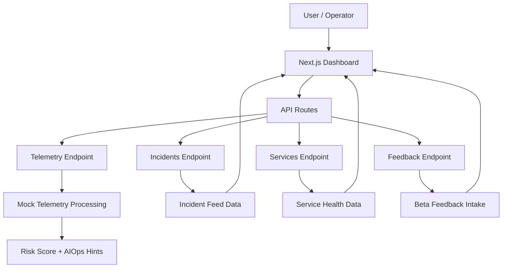

# DataCenterAIOps

> Open-source AIOps control center for logs, metrics, traces, incidents, and early product feedback.

[](https://data-center-ai-ops.vercel.app/)
[](https://nextjs.org/)
[](https://www.typescriptlang.org/)
[](https://vercel.com/)
[](https://github.com/SamoTech/DataCenterAIOps/stargazers)
[](#license)
[](https://github.com/sponsors/SamoTech)
[](https://github.com/SamoTech)

DataCenterAIOps is a lightweight MVP for turning noisy telemetry into a cleaner incident workflow. It gives teams a live dashboard for service health, correlated incidents, root-cause hints, and an in-app feedback flow to validate the product before full rollout.

## Live Demo

- Demo: https://data-center-ai-ops.vercel.app/
- Repository: https://github.com/SamoTech/DataCenterAIOps

## Preview

The current live demo includes:

- A dark AIOps dashboard landing page
- Incident feed with severity and root-cause hints
- Service health table with latency, error rate, and uptime
- Early-access feedback form for beta validation
- API routes for telemetry, incidents, services, and feedback

## Why this project

Modern teams often have logs in one tool, metrics in another, alerts in a third place, and feedback somewhere else. DataCenterAIOps starts with a simpler idea: one place to understand what is happening, what is impacted, and what should happen next.

This repository is currently focused on the MVP stage:

- Modern dashboard UI for incidents and service health
- Mock AIOps-style incident correlation and risk scoring
- Telemetry ingestion endpoints for experimentation
- Early-access feedback collection inside the product
- Strong starter base for a production-ready AIOps platform

## Current Features

### Dashboard

- Hero overview with risk score and active incident summary
- Incident feed with severity, status, impact, and likely cause
- Service health table with latency, error rate, and uptime metrics
- MVP proof section that explains the direction of the product

### API

- `GET /api/incidents` → Returns incident feed data
- `GET /api/services` → Returns service health data
- `GET /api/telemetry` → Returns telemetry overview and supported signals
- `POST /api/telemetry` → Accepts telemetry-like payloads and returns AIOps guidance
- `POST /api/feedback` → Accepts beta feedback from demo users

### Feedback Flow

- Name, email, role, and team-size capture
- 1–5 rating input for fast product validation
- Free-text product feedback submission
- Frontend success and error handling for form submissions

## Tech Stack

- Next.js 14
- React 18
- TypeScript
- App Router
- Vercel deployment workflow

## Quick Start

### 1) Install dependencies

```bash
npm install
```

### 2) Run locally

```bash
npm run dev
```

### 3) Open the app

```text
http://localhost:3000
```

## API Examples

### Send telemetry

```bash
curl -X POST http://localhost:3000/api/telemetry \
  -H "Content-Type: application/json" \
  -d '{
    "service": "payments-api",
    "signal": "latency",
    "value": 920,
    "severity": "high",
    "message": "Latency spike detected"
  }'
```

### Submit feedback

```bash
curl -X POST http://localhost:3000/api/feedback \
  -H "Content-Type: application/json" \
  -d '{
    "name": "Ossama",
    "email": "beta@example.com",
    "rating": 5,
    "role": "DevOps Engineer",
    "teamSize": "1-10",
    "message": "Strong concept, next I want Telegram alerts and persistent storage"
  }'
```

## Architecture



## Project Structure

```text
DataCenterAIOps/
├── app/
│   ├── api/
│   │   ├── feedback/
│   │   │   └── route.ts
│   │   ├── incidents/
│   │   │   └── route.ts
│   │   ├── services/
│   │   │   └── route.ts
│   │   └── telemetry/
│   │       └── route.ts
│   ├── globals.css
│   ├── layout.tsx
│   └── page.tsx
├── components/
│   ├── feedback-form.tsx
│   ├── metric-card.tsx
│   └── section-card.tsx
├── lib/
│   └── mock-data.ts
├── .gitignore
├── next-env.d.ts
├── next.config.js
├── package.json
├── README.md
└── tsconfig.json
```

## Product Direction

This MVP is the first step toward a fuller AIOps platform with features such as:

- OpenTelemetry ingestion
- Real alert correlation
- Persistent incident storage
- Slack and Telegram notifications
- Auth and team workspaces
- Postmortem generation
- Admin review for beta submissions
- AI-powered root-cause explanation

## Deployment

This project is ready to deploy on Vercel.

Typical workflow:

1. Connect the GitHub repository to Vercel
2. Use `main` as the production branch
3. Push changes to GitHub
4. Let Vercel build and publish automatically

## Contributing

Contributions, ideas, and product feedback are welcome.

1. Fork the repository
2. Create a feature branch
3. Make your changes
4. Open a pull request

If you want to suggest a major feature, open an issue first so the direction stays aligned.

## Support

- Issues: https://github.com/SamoTech/DataCenterAIOps/issues
- Repository: https://github.com/SamoTech/DataCenterAIOps
- GitHub Profile: https://github.com/SamoTech

## Sponsor

If this project helps you or your team, support development through GitHub Sponsors:

- GitHub Sponsors: https://github.com/sponsors/SamoTech

## Roadmap

### Near term

- Persist feedback submissions
- Add admin view for responses
- Improve API validation
- Add loading and empty states

### Mid term

- Real telemetry ingestion
- Incident timelines
- Notification routing
- Team access control

### Long term

- Multi-project workspaces
- AI incident summaries
- Suggested remediation steps
- Full observability integrations

## License

MIT
