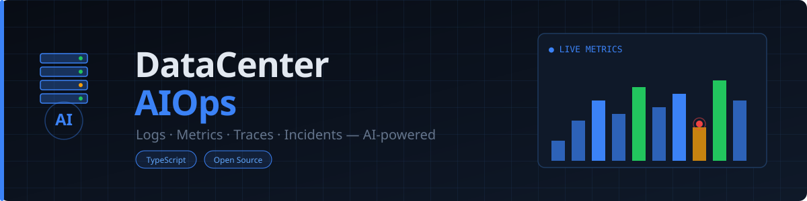
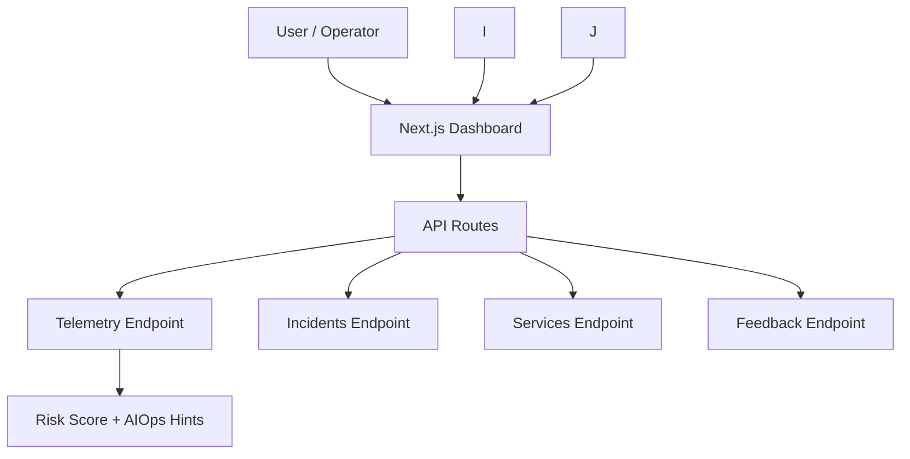

# DataCenterAIOps



> Open-source AIOps control center for logs, metrics, traces, incidents, and early product feedback.

[](https://data-center-ai-ops.vercel.app/)
[](https://nextjs.org/)
[](https://www.typescriptlang.org/)
[](https://vercel.com/)
[](https://github.com/SamoTech/DataCenterAIOps/stargazers)
[](#license)

DataCenterAIOps is a lightweight MVP for turning noisy telemetry into a cleaner incident workflow. It gives teams a live dashboard for service health, correlated incidents, root-cause hints, and an in-app feedback flow to validate the product before full rollout.

## Live Demo

- Demo: https://data-center-ai-ops.vercel.app/
- Repository: https://github.com/SamoTech/DataCenterAIOps

## Current Features

### Dashboard

- Hero overview with risk score and active incident summary
- Incident feed with severity, status, impact, and likely cause
- Service health table with latency, error rate, and uptime metrics

### API

- `GET /api/incidents` → Returns incident feed data
- `GET /api/services` → Returns service health data
- `GET /api/telemetry` → Returns telemetry overview and supported signals
- `POST /api/telemetry` → Accepts telemetry-like payloads and returns AIOps guidance
- `POST /api/feedback` → Accepts beta feedback from demo users

## Tech Stack

- Next.js 14
- React 18
- TypeScript
- App Router
- Vercel deployment workflow

## Quick Start

```bash
npm install
npm run dev
# Open http://localhost:3000
```

## API Examples

```bash
curl -X POST http://localhost:3000/api/telemetry \
  -H "Content-Type: application/json" \
  -d '{"service": "payments-api", "signal": "latency", "value": 920, "severity": "high"}'
```

## Architecture


```mermaid
flowchart TD
    A[User / Operator] --> B[Next.js Dashboard]
    B --> C[API Routes]
    C --> D[Telemetry Endpoint]
    C --> E[Incidents Endpoint]
    C --> F[Services Endpoint]
    C --> G[Feedback Endpoint]
    D --> H[Risk Score + AIOps Hints]
    I --> B
    J --> B
```

## Deployment

1. Connect the GitHub repository to Vercel
2. Use `main` as the production branch
3. Push changes to GitHub
4. Let Vercel build and publish automatically

## Product Roadmap

- OpenTelemetry ingestion
- Real alert correlation
- Persistent incident storage
- Slack and Telegram notifications
- Auth and team workspaces
- AI-powered root-cause explanation

## License

MIT
